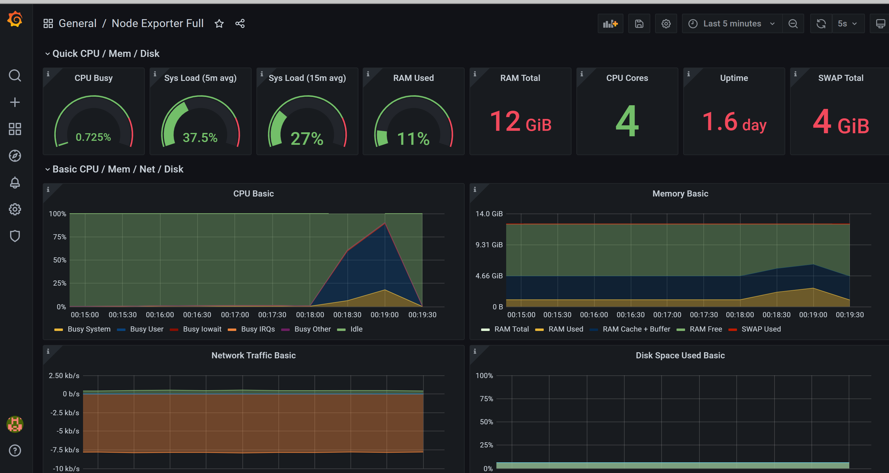

# Домашнее задание

## Настройка мониторинга для Spark-приложения

### Цель
 В данном ДЗ мы закрепим навыки настройки мониторинга Spark-приложений с помощью связки "Prometheus+Grafana". В результате студенты смогут попрактиковаться в решении одной из типовых задач, встающих при rollout-е Spark-приложения.

### Запуск
- `sbt assembly`
- `docker build -f Spark/Dockerfile .`
- `docker-compose up -d`

### Screenshots
- Grafana / Node Exporter:

  

